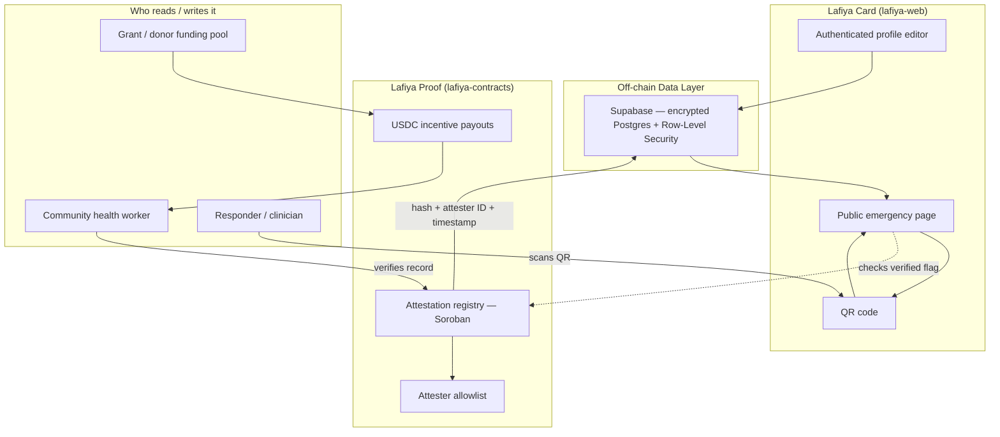

# Lafiya

[](https://stellar.org)
[](https://soroban.stellar.org)
[](#license)
[](#roadmap)

A patient-owned emergency health card on Stellar — the vitals that decide emergency treatment travel with the patient as a scannable QR code, work offline, and can be cryptographically verified by a health worker so a first responder can trust them on the spot.

_Lafiya_ is Hausa for health, safety, and wellbeing.

> **Status:** Pre-alpha · Stellar **testnet** · Live: [lafiya-web.vercel.app](https://lafiya-web.vercel.app) · not yet audited · not a medical device. See [Disclaimer](#disclaimer).

## Overview

Lafiya is a free, patient-owned emergency health card. The handful of facts that change how a patient is treated in an emergency — blood group, genotype, allergies, current medications, chronic conditions — travel with them as a scannable QR code, work offline, and can be cryptographically verified by a health worker.

This repository (`lafiya-web`) contains the patient + responder web app — the Lafiya Card product surface: the public emergency page, the authenticated profile editor, and QR generation. The Soroban attestation contracts, CHW verifier tooling, and project docs live in separate repos — see [Lafiya Organization](#lafiya-organization) below.

### The Problem

In Nigeria, health records are paper, siloed per facility, and effectively lost the moment a patient moves, is referred, or arrives unconscious. In an emergency, the facts that decide treatment are usually unknown to whoever is treating the patient. Wrong assumptions cost lives:

- **Genotype (AS/SS sickle-cell status), blood group, and drug allergies** are rarely known at the point of care
- **Referrals and facility transfers** lose the paper trail entirely
- **Unconscious or non-verbal patients** cannot supply the facts themselves
- **No existing system** lets a first responder trust a record without calling the issuing facility

### What Lafiya Does

- **For the patient / mother** — a free card carried on a phone or printed, that speaks for them when they can't
- **For the responder / clinician** — scan the QR, no login, see only the decision-relevant subset, with a clear "verified" indicator that can be trusted
- **For the community health worker (CHW)** — get paid in USDC on Stellar for each person registered and verified, solving the last-mile distribution problem

## Features

- **Lafiya Card**: a patient-owned profile behind a login; the patient chooses exactly what appears on a minimal, read-only public emergency page reachable by QR
- **Offline-first emergency page**: readable without a login and without a network connection once cached, so a responder can read it in a dead zone
- **Cryptographic attestation (Soroban)**: a licensed health worker's verification is recorded on-chain as a hash of the record + the attester's identity + a timestamp — never the health data itself
- **CHW incentive rails (USDC on Stellar)**: community health workers are paid a micro-amount per verified registration, with near-zero fees and stablecoin settlement
- **Transparent funding**: grant and donor funds flow on-chain into the CHW incentive pool, so every dollar maps to a countable number of verified cards
- **Privacy by design**: no personal health data ever touches the blockchain; only hashes, attestations, and payments are on-chain

## Architecture



### Core Components

- **app/(public)/card/[id]**: public, read-only emergency page — the page a QR code points to
- **app/(auth)/profile**: authenticated profile editor where a patient manages their private record
- **lib/supabase/**: Supabase client/server helpers and hand-authored types for the off-chain encrypted store
- **lib/stellar/**: pre-M1 attestation stub, ready to swap for a real Soroban contract call
- **lib/qr/**: QR code generation for the emergency page

The Soroban attestation registry, attester allowlist, and CHW verifier tool live in the `lafiya-contracts` and `lafiya-verifier` repos respectively — see [Lafiya Organization](#lafiya-organization).

## Attestation & Trust Layer

Lafiya Proof is the Stellar-native trust and payment layer underneath the Lafiya Card:

| Layer                   | Mechanism                                                                       | What it guarantees                                                                                                                          |
| ----------------------- | ------------------------------------------------------------------------------- | ------------------------------------------------------------------------------------------------------------------------------------------- |
| **Attestation**         | Soroban on-chain record: hash of the record + attester's identity + a timestamp | A responder can cryptographically confirm a real, allowlisted health worker verified this exact record, without the data ever being exposed |
| **Incentive rails**     | USDC on Stellar, paid per verified registration                                 | Near-zero-fee, cross-border micropayments make last-mile CHW outreach economically viable                                                   |
| **Transparent funding** | Grant and donor funds flow on-chain into the CHW incentive pool                 | Every donated dollar maps to a countable, auditable number of verified cards                                                                |

> **Core design principle.** No personal health data ever touches the blockchain. Personal data lives in an encrypted, access-controlled off-chain database. Stellar holds only hashes, attestations, and payments. This is what keeps Lafiya both privacy-respecting and regulator-compatible — and it is why Stellar is a _core_ component here, not a database substitute.

### Why Stellar (core, not shoehorned)

Stellar/Soroban does two things Lafiya genuinely needs that a plain web app cannot: it makes verification tamper-evident and independently checkable without exposing data, and it moves stablecoin micropayments to health workers cheaply and across borders. Remove Stellar and the trust layer and the incentive engine both disappear.

## Soroban Smart Contract Layer

The Soroban contract is the on-chain trust layer for Lafiya attestations — planned for `lafiya-contracts`, landing with milestone **M1**.

### Contract Functions (planned)

- `attest(record_hash: BytesN<32>, attester: Address, timestamp: u64)` - registers an attestation for a record hash (allowlisted attester only)
- `get_attestation(record_hash: BytesN<32>) -> Attestation` - read-only; returns the most recent attestation for a record hash, callable by any verifier
- `is_allowlisted(attester: Address) -> bool` - read-only; checks whether an address is a registered health worker

```rust
// Planned Soroban interface (Rust pseudocode) — lands with lafiya-contracts, M1
pub struct Attestation {
    pub record_hash: BytesN<32>,  // hash of the patient record; never the data itself
    pub attester: Address,        // allowlisted health worker's Stellar address
    pub timestamp: u64,           // ledger timestamp of the attestation
}
```

This composability lets a responder's scanner, or any other Stellar-aware verifier, confirm a record was attested by a real, allowlisted health worker — without an external oracle and without ever seeing the health data.

**M1 handoff point.** This repo already has the pieces that plug into the contract above: `lib/attestation/recordHash.ts` computes the deterministic hash a `lafiya-contracts` call would use, and `lib/stellar/attestation.ts` exposes a `getAttestation(recordHash)` function with the signature the real Soroban call will have — today it's an in-memory mock (documented in the file itself) since `lafiya-contracts` doesn't exist yet. Swapping the mock body for a real contract call, once that repo ships, shouldn't require touching any caller (the public card page, the attestation Route Handler).

## Data Model (Emergency Subset)

The public emergency page is intentionally minimal:

- Name, age, photo
- **Blood group and genotype**
- Drug allergies
- Current medications (esp. anticoagulants, insulin, anti-epileptics)
- Chronic conditions / implants
- Emergency contact(s)
- Language spoken

Everything else (full history, documents, notes) stays private, behind authentication.

## Privacy & Compliance

- **Nigeria Data Protection Act (2023)** governs all personal data held. Consent, encryption, and minimal disclosure are designed in from day one.
- Patients opt into exactly what appears on their public page.
- No health data on-chain; only non-reversible hashes and attestations.

## Repository Structure

This repository (`lafiya-web`) contains the patient + responder web app. The Soroban contracts, docs, and CHW verifier tool live in separate repos — see [Lafiya Organization](#lafiya-organization) below.

```
lafiya-web/
│
├── README.md
├── package.json
├── .env.example                  ← Config template (real values go in .env.local, gitignored)
├── .env.test                     ← Fixed local-only Supabase demo keys for integration tests
├── next.config.ts
├── proxy.ts                      ← Session refresh + route protection (Next 16's "middleware")
├── vitest.config.ts              ← Unit/component tests (jsdom)
├── vitest.integration.config.ts  ← Integration tests (node, against a running `supabase start`)
│
├── .github/workflows/ci.yml
│
├── supabase/
│   ├── config.toml
│   ├── seed.sql                  ← Demo patient fixture for local dev
│   └── migrations/                ← profiles table + RLS, get_emergency_card RPC, avatars bucket
│
├── app/
│   ├── page.tsx                  ← Landing page
│   ├── (public)/card/[id]/       ← Public, read-only emergency page (QR target)
│   ├── (auth)/
│   │   ├── signup/ signin/ signout/
│   │   └── profile/              ← Authenticated profile editor (identity, blood group/genotype,
│   │                                allergies/medications, chronic conditions, emergency contacts,
│   │                                photo upload, QR + link display)
│   └── api/attestation/[recordHash]/  ← Read-only attestation lookup Route Handler
│
├── lib/
│   ├── env.ts                    ← zod-validated environment config
│   ├── supabase/                 ← Client/server helpers + hand-authored Database types
│   ├── validation/                ← Profile form zod schema
│   ├── qr/                       ← QR code generation
│   ├── attestation/               ← Record-hash canonicalization + types
│   ├── stellar/                  ← Pre-M1 attestation stub
│   └── url/                      ← Request-derived base URL helper
│
└── tests/
    ├── setup.ts
    └── integration/               ← RLS + RPC tests against a real local Supabase
```

## Quick Start

### 1. Install dependencies

```bash
npm install
```

### 2. Start local Supabase and configure environment

```bash
npx supabase start
cp .env.example .env.local
```

`supabase start` prints an `ANON_KEY` and `SERVICE_ROLE_KEY` — put those (and the printed `API_URL`, usually `http://127.0.0.1:54321`) into `.env.local` as `NEXT_PUBLIC_SUPABASE_URL`, `NEXT_PUBLIC_SUPABASE_ANON_KEY`, and `SUPABASE_SERVICE_ROLE_KEY`. `supabase db reset` applies migrations and seeds one demo patient (`demo@lafiya.test` / `lafiya-demo-password`, card id `11111111-1111-1111-1111-111111111111`) for local testing. See [Lafiya Organization](#lafiya-organization) for what each variable is for.

### 3. Run the dev server

```bash
npm run dev
```

Visit `/signup` to create a card, `/profile` to edit it, or `/card/11111111-1111-1111-1111-111111111111` to see the seeded demo patient's public emergency page.

## Testing

```bash
npm test               # unit + component tests (Vitest + React Testing Library, jsdom)
npx supabase start     # required once, before integration tests
npm run test:integration  # RLS + RPC tests against real local Postgres
```

- [x] Public emergency page renders only the patient-selected subset
- [x] Row-Level Security policies enforce patient-only read/write access (plus a table-level GRANT, which RLS alone doesn't provide)
- [x] QR generation produces a valid, input-dependent data URL
- [x] Verified-indicator rendering for both the verified and not-yet-verified states
- [x] `get_emergency_card` RPC contract: valid id, unknown id, anon-callable, no extra columns leak

Run `npm run lint && npm run typecheck && npm run build` for the same checks CI runs on every push/PR (see `.github/workflows/ci.yml`).

## Deployment & Vercel Configuration

Lafiya is deployed on Vercel and integrates with a hosted Supabase project for user management, profiles, and image storage, and connects to the Stellar Testnet.

### 1. Database Provisioning (Supabase)
To set up a new production/staging database:
1. Create a project in [Supabase](https://supabase.com).
2. Install the Supabase CLI locally and link it to your project:
   ```bash
   npx supabase link --project-ref <your-supabase-project-ref>
   ```
3. Run the database migrations against the hosted project:
   ```bash
   npx supabase db push
   ```
4. Set up an `avatars` storage bucket in the Supabase dashboard and make it public (so patient avatars can be served).

### 2. Environment Variables Configuration
Configure the following environment variables in your Vercel Project Settings (`Settings > Environment Variables`):

| Variable Name | Environment(s) | Description / Value |
| :--- | :--- | :--- |
| `NEXT_PUBLIC_SUPABASE_URL` | Production & Preview | The API URL of your hosted Supabase project. |
| `NEXT_PUBLIC_SUPABASE_ANON_KEY` | Production & Preview | The anon/public API key of your hosted Supabase project. |
| `SUPABASE_SERVICE_ROLE_KEY` | Production & Preview | The service_role secret key (never exposed to client). |
| `STELLAR_NETWORK_PASSPHRASE` | Production & Preview | `"Test SDF Network ; September 2015"` (Stellar Testnet). |
| `SOROBAN_RPC_URL` | Production & Preview | `https://soroban-testnet.stellar.org` (Soroban testnet RPC endpoint). |
| `ATTESTATION_CONTRACT_ID` | Production & Preview | The contract ID of your deployed `lafiya-contracts` registry (once available). |

*Note: All values must be configured for both Production and Preview environments to ensure branch builds pass Zod schema validation during deployment.*

### 3. Preview-Deployment Data-Isolation Strategy
We use a **Shared Testnet Database** strategy for all Vercel Preview Deployments (such as Pull Requests) rather than provisioning ephemeral databases per PR.
* **Why this is chosen:** Ephemeral databases (automated creation and destruction of Supabase projects on demand) introduce high operational complexity, require automated API keys, and easily hit the limits of Supabase free tier projects.
* **Mitigation of Collisions:** Since profiles are isolated by authenticated user IDs (enforced by Supabase Row-Level Security), testers can isolate their preview-deployment testing by creating unique user accounts (e.g. using distinct emails like `tester+pr12@example.com`).

## Roadmap

### M0 — Public Card _(testnet)_

- [x] Patient can create a profile via `lafiya-web` (auth, and a field-by-field editor: identity, blood group/genotype, allergies/medications, chronic conditions, up to 3 emergency contacts, optional photo)
- [x] Public, read-only emergency page reachable by QR, with a verified-indicator placeholder ahead of real M1 attestation
- [x] Unit, component, and integration test coverage, with CI on every push/PR
- [x] Deployed to Vercel against Stellar testnet config

### M1 — Attestation

- [ ] Soroban attestation registry deployed (`lafiya-contracts`)
- [ ] Allowlisted attester can verify a record
- [ ] Card displays a verified indicator

### M2 — Incentives

- [ ] USDC-on-Stellar payout wired to attestation events
- [ ] CHW payout tracking

### M3 — Pilot

- [ ] Small, supervised field pilot
- [ ] Metrics: verified cards created, scan events

### M4 — Mainnet + Funding

- [ ] Mainnet deployment
- [ ] Transparent on-chain funding pool live

## Why This Matters for the Stellar Ecosystem

A health record that can't be trusted at the point of care is one that costs lives. Lafiya addresses this directly:

- **For patients and mothers** — a free card that speaks for them when they can't, without requiring technical expertise
- **For responders and clinicians** — a verified indicator they can trust on the spot, with no login and no facility call required
- **For community health workers** — a real, near-zero-fee income stream tied to verified registrations, solving last-mile distribution
- **For the Stellar Foundation and ecosystem** — a Digital Public Good that demonstrates Soroban attestations and stablecoin micropayments solving a real-world, life-or-death problem

Lafiya is built as an open-source **Digital Public Good** (SDG 3, Good Health and Well-being):

- **Primary:** Stellar Community Fund (SCF) — Build track
- **Bridge:** Registration against the Digital Public Goods Standard
- **Later:** DPG-aligned and public-goods streaming funders once real-world impact is demonstrable

## Dependencies

- Node.js 24+ / Next.js 16 (App Router) — deployed on Vercel
- Supabase (`@supabase/supabase-js`, `@supabase/ssr`) — Postgres, Auth, Storage, Row-Level Security
- `zod` — environment and form validation
- `qrcode` — QR code generation
- Vitest, React Testing Library — unit, component, and integration tests
- Soroban / Stellar SDK — planned for M1, once `lafiya-contracts` exists; not a dependency of this repo yet
- W3C Verifiable Credentials data model, HL7 FHIR — standards informing the data model (see [References](#references))

## License

**MIT** (OSI-approved; see [LICENSE](LICENSE)).

## Contributing

We welcome contributions to Lafiya! Please read our [Contributing Guide](CONTRIBUTING.md) for local setup, development guidelines, database migration instructions, and code conventions before submitting a pull request.

## Lafiya Organization

This project lives under the `lafiya-xyz` GitHub organization. This repo is one of five. If a change here touches a shared contract (below), call it out so the matching repo can be updated.

| Repo                                                                   | Role                                                                                      | Primary language     |
| ---------------------------------------------------------------------- | ----------------------------------------------------------------------------------------- | -------------------- |
| [`.github`](https://github.com/lafiya-xyz/.github)                     | Organization profile README and contribution guidelines                                   | Markdown             |
| [`lafiya-docs`](https://github.com/lafiya-xyz/lafiya-docs)             | Concept note, data model, threat model, privacy design, funding/DPG materials, references | Markdown             |
| [`lafiya-web`](https://github.com/lafiya-xyz/lafiya-web) _(this repo)_ | Patient + responder web app. Public emergency page, authed profile editor, QR generation  | TypeScript (Next.js) |
| [`lafiya-contracts`](https://github.com/lafiya-xyz/lafiya-contracts)   | Soroban smart contracts (Rust): attestation registry + attester allowlist. Testnet first  | Rust (Soroban)       |
| [`lafiya-verifier`](https://github.com/lafiya-xyz/lafiya-verifier)     | CHW verification tool. Begins as a route inside `lafiya-web`; split out only if it grows  | TypeScript (planned) |

> Resist scaffolding empty repos. Two working repos (`lafiya-web`, `lafiya-contracts`) beat five half-built ones. Build one honest milestone at a time.

### Data Flow

```
lafiya-docs        ──(data model, threat model)──▶  lafiya-web
                                                        │
   patient input ──(profile data)──▶                   │  (Supabase, encrypted)
                                                        │
                                                        ▼
                                          Public emergency page (QR)
                                                        │
                        ┌───────────────────────────────┴───────────────────────────────┐
                        ▼                                                               ▼
              lafiya-contracts (Soroban)                                    lafiya-verifier (CHW tool)
                        │                                                               │
                        ▼                                                               ▼
        On-chain attestation + USDC payout                          Responder scans QR, sees verified flag
```

### Shared Contracts (must stay in sync across repos)

**1. Attestation schema** — a hash of the record + the attester's identity + a timestamp, defined conceptually here and mirrored by `lafiya-contracts`'s on-chain `Attestation` struct:

```
Attestation {
    record_hash: BytesN<32>   // hash of the patient record; never the data itself
    attester:    Address       // allowlisted health worker's Stellar address
    timestamp:   u64           // ledger timestamp of the attestation
}
```

If you change a field name, type, or hashing scheme here, update the Rust struct in `lafiya-contracts` in the same change set (or open a tracked follow-up in each repo).

**2. Emergency data model** — the field list in [Data Model](#data-model-emergency-subset) is the canonical decision-relevant subset. `lafiya-docs` mirrors it in the full data model / threat model; changing a field name here requires an update there.

**3. Environment variables / config keys** — `.env.example` defines the cross-repo keys:

- `NEXT_PUBLIC_SUPABASE_URL` / `NEXT_PUBLIC_SUPABASE_ANON_KEY` — the off-chain encrypted store; safe for the browser, scoped by RLS
- `SUPABASE_SERVICE_ROLE_KEY` — server-only, bypasses RLS; never exposed to the browser
- `STELLAR_NETWORK_PASSPHRASE` — must match the network the contracts are deployed on
- `SOROBAN_RPC_URL` — Soroban RPC endpoint (testnet first)
- `ATTESTATION_CONTRACT_ID` — the deployed `lafiya-contracts` attestation registry contract id

### Open Integration Points (not yet implemented)

- How `lafiya-web` calls `lafiya-contracts` — direct Soroban RPC from the app vs. a thin backend service
- How the attester allowlist is managed and updated — governance model not yet decided
- The exact USDC payout trigger — per attestation event vs. batched payouts

### Conventions for AI Agents

An agent working in only one of the five repos above can't see the others' code, so this section exists to orient one dropped into any single repo without prior context:

- Treat this section as the source of truth for **cross-repo** contracts. Each repo's own README covers repo-local conventions.
- When a change in this repo affects a shared contract above, call it out explicitly so the corresponding change can be made in the other repo(s) — don't silently assume it'll happen separately.
- Never let personal health data reach an on-chain call — only hashes, attester identity, and timestamps belong in `lafiya-contracts` calls. This is a hard invariant, not a style preference.
- Keep attestation and health-record field names identical (same casing, same units) across TypeScript (`web`), Rust (`contracts`), and Markdown (`docs`) — translation layers are a common source of bugs.
- If you land in `lafiya-docs`, read its data model doc before touching any patient-data field name anywhere in the org. If you land in `lafiya-contracts`, read the `Attestation` struct definition before changing the hash/attester/timestamp shape. If you land in `lafiya-verifier`, note it currently lives inside `lafiya-web` at `app/(auth)/profile` and the attestation-lookup code, not as a standalone repo yet.

## Support

For issues and questions:

- GitHub Issues: [Create an issue](https://github.com/lafiya-xyz/lafiya-web/issues)

## Disclaimer

Lafiya is an information aid, **not a medical device** and **not a substitute for professional medical judgment**. Verified indicators reflect that a record was attested by a registered health worker; they are not a clinical guarantee. Treatment decisions remain the responsibility of the attending clinician.

## References

These works directly informed Lafiya's design and are the intended reading for contributors.

**Books**

- Shortliffe, E. H., & Cimino, J. J. (Eds.). (2021). _Biomedical Informatics: Computer Applications in Health Care and Biomedicine_ (5th ed.). Springer. — Grounds the clinical data model: which fields are decision-relevant in an emergency, and how health records are structured and coded.
- Preukschat, A., & Reed, D. (2021). _Self-Sovereign Identity: Decentralized Digital Identity and Verifiable Credentials_. Manning. — The blueprint for Lafiya Proof: issuer/holder/verifier roles, verifiable credentials, hash-based attestation, key management, and offline verification.
- Toyama, K. (2015). _Geek Heresy: Rescuing Social Change from the Cult of Technology_. PublicAffairs. — Keeps the project honest: technology amplifies human capacity rather than replacing it, which is why Lafiya centers community health workers, not the app.
- Kleppmann, M. (2017). _Designing Data-Intensive Applications_. O'Reilly. — Informs the off-chain data layer: reliable and secure storage, encryption, and the boundary between what lives in the database and what is anchored on-chain.
- Martin, R. C. (2017). _Clean Architecture: A Craftsman's Guide to Software Structure and Design_. Prentice Hall. — Discipline for an AI-assisted codebase: clear boundaries so the app, the contracts, and the data layer stay independently maintainable.

**Standards & documentation**

- Stellar Development Foundation — Stellar and Soroban developer documentation.
- W3C — Verifiable Credentials Data Model.
- HL7 — FHIR (health-data interoperability standard).
- Nigeria Data Protection Act (2023) — Nigeria Data Protection Commission.
- Digital Public Goods Alliance — DPG Standard.

---

<div align="center">

**Lafiya** — Your vitals, verified. When you can't speak, Lafiya does.

_Built for the Stellar ecosystem. Open source. Community owned._

</div>
